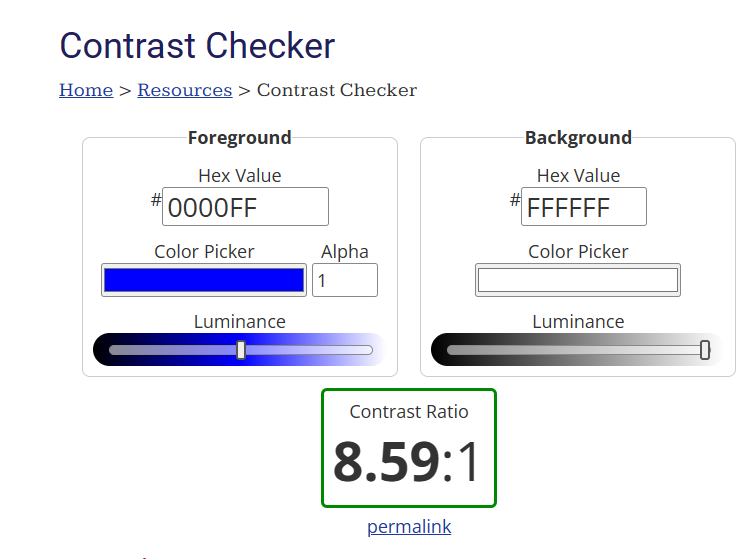
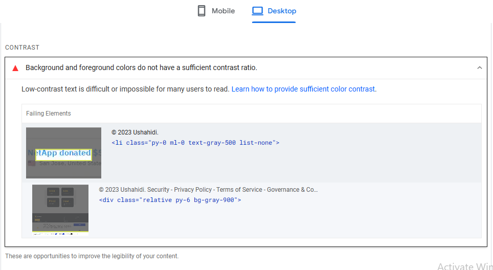
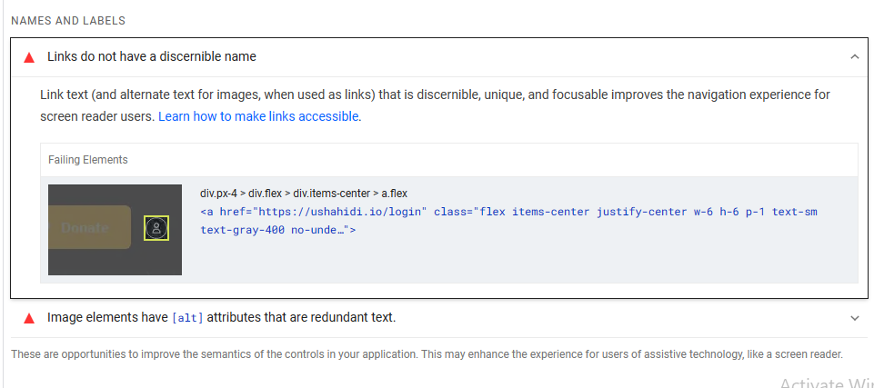
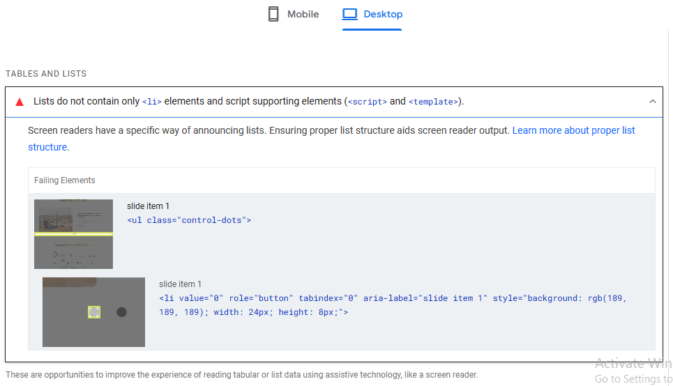
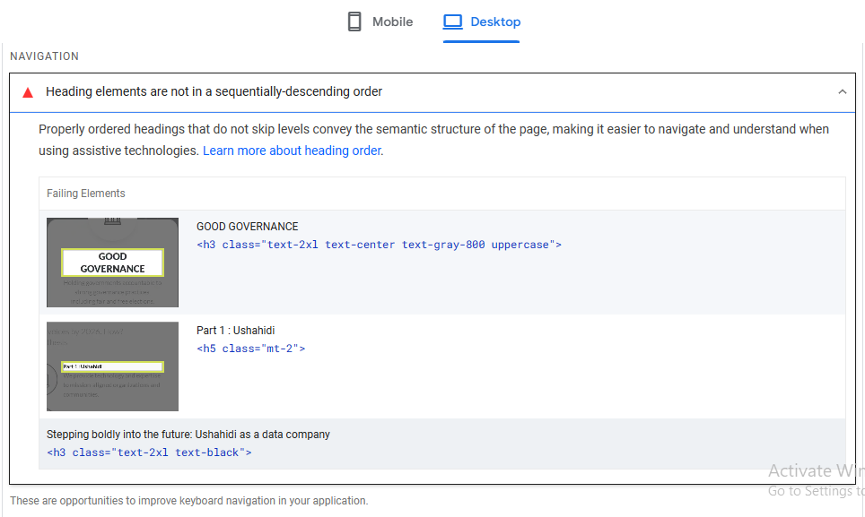
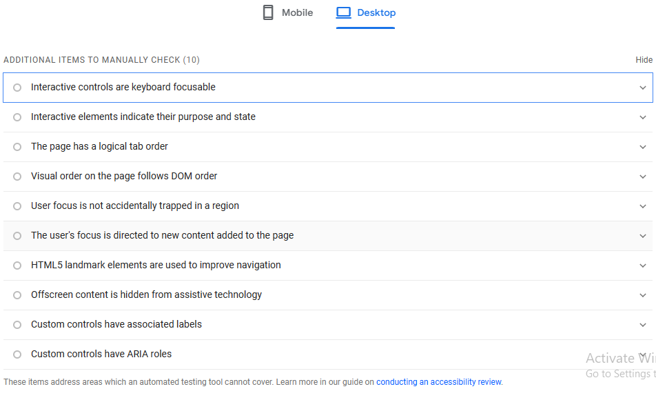

# Accessibility Testing on Ushahidi

Accessibility might seem menial but it is a key component of good web design and makes sure that your website does not exclude a sizable portion of your audience. It ensures that individuals with disabilities can perceive, understand, navigate and interact with your website effectively and eliminates barriers that might prevent them from accessing information or using digital services, thereby promoting inclusivity.

The Ushahidi website can be tested for accessibility through the following, using the Web Content Accessibility Guidelines (WCAG) published by the World Wide Web Consortium (W3C):
- ## Automated Tooling
Tools such as;
    - **Lighthouse (Google Chrome Dev Tools)**,
    - **Wave (browser extension or online tool)**,
    - **PageSpeed Insights (this particular tool helps with the parts that you need to fix and gives feedback on them)**

- ## Manual Testing
This involves using manual accessibility testing to catch issues. This includes;

- **Navigating the Ushahidi site with only a keyboard:**
    This can be done by simply visiting  and pressing the TAB key to jump from one element to another, hitting the Enter key to visit the lined pages or perform an action.

- **Sufficient Color Contrast:**

    Users with visual impairment such as color blindness will be unable to read content if there is no sufficient contrast between elements. Tools like WebAIM Contrast Checker  can help with checking for the right color contrasts.

For example, I used PageSpeed Insight to gain some insight into Ushahidi’s homepage and noticed that the cookie popup came back with some issues. The WebAIM might help with better color contrast for that dialog box.

- **Disabling Animated Content:**
    Animated content like videos or images that play automatically would overwhelm or distract users with cognitive issues. Disabling autoplay would give control to the users. The users can increase the volume, decrease the volume or play the videos themselves.

- **Images without ALT text:**
    Another important step is making sure that every image has an alt text and also a title text that when hovered on, describes the image and also helps screen readers with visual disabilities to identify. PageSpeed Insights also helps. Here is an example below;

- **Ensure that elements like Tables, Headings and Bullet lists are marked properly using Semantic HTML**

    This also helps individuals with visual impairments to navigate the web easily. Tables should be wrapped in the <td>, <th>, and <tr> tags, while bullet lists should be placed within the <ul> and <li> tags. Headings should also be wrapped in tags such as <h2> or <h3>. For example:

- **Test Interactive Tools such as Forms:**

Interactive tools such as Forms and Buttons. Forms with labels should be marked properly. Form validation is necessary. This helps to identify an error while filling out a form. For example, an individual with dyslexia might mistype an email address. The extra information would help in informing them where they need to correct the error. Other elements such as dropdown menus, radio buttons and call-to-action buttons should also be checked so that they are easy to use and understand.

- **KEY THINGS TO NOTE**
    - Interactive controls are keyboard-focusable.
    - Interactive elements indicate their purpose and state.
    - The page has a logical tab order
    - Visual order on the page follows DOM order
    - User focus is not accidentally trapped in a region.
    - The user’s focus is directed to new content added to the page.
    - HTML5 landmark elements are used to improve navigation.
    - Offscreen content is hidden from assistive technology
    - Custom controls have associated labels
    - Custom controls have ARIA roles.

## Conclusion

The Ushahidi team is making sure that the ushahidi website is accessible to everyone, inclusive of everyone and excluding none. This is why a structure is being put in place to ensure and maintain accessibility. 
