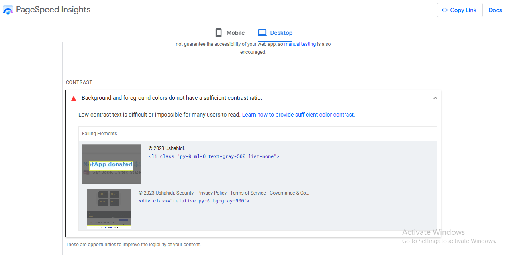
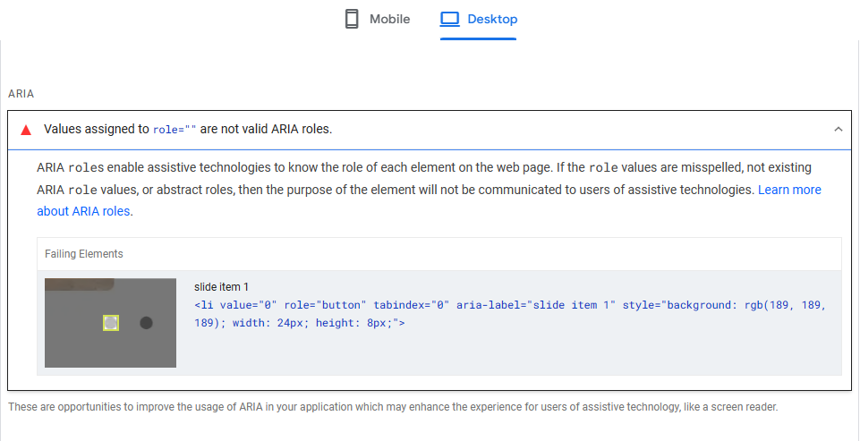

# Accessibility Testing on Ushahidi

Accessibility might seem menial but it is a key component of good web design and makes sure that your website does not exclude a sizable portion of your audience. It ensures that individuals with disabilities can perceive, understand, navigate and interact with your website effectivity and eliminates barriers that might prevent them from accessing information or using digital services, thereby promoting inclusivity.

The Ushahidi website can be tested for accessibility through the following, using the Web Content Accessibility Guidelines (WCAG) published by the World Wide Web Consortium (W3C):
- ## Automated Tooling
Tools such as;
    - **Lighthouse (Google Chrome Dev Tools)**,
    - **Wave (browser extension or online tool)**,
    - **PageSpeed Insights (this particular tool helps with the parts that you need to fix and gives feedback on them)**

    

    

- ## Manual Testing
This involves using manual accessibility testing to catch issues. This includes;

- **Navigating the Ushahidi site with only a keyboard:**
    This can be done by simply visiting  and pressing the TAB key to jump from one element to another, hitting the Enter key to visit the lined pages or perform an action.

- **Sufficient Color Contrast:**

    Users with visual impairment such as color blindness will be unable to read content if there is no sufficient contrast between elements. Tools like WebAIM Contrast Checker  can help with checking for the right color contrasts.

